# URA IVR Architecture — Q&A Session

> **Date:** February 13, 2026  
> **Context:** Architecture decisions for building an IVR (URA) system using Azure Communication Services (ACS), Azure AI Voice Live API, and Azure APIM for a telecommunications provider.

---

## Table of Contents

1. [Azure APIM and Event Grid Integration](#1-azure-apim-and-event-grid-integration)
2. [Event Grid IncomingCall Flow — APIM or Direct?](#2-event-grid-incomingcall-flow--apim-or-direct)
3. [ACS Webhook Callbacks — Same Approach?](#3-acs-webhook-callbacks--same-approach)
4. [Azure AI Voice Live API — Conversational IVR Flow](#4-azure-ai-voice-live-api--conversational-ivr-flow)
5. [Security Architecture](#5-security-architecture)
6. [Technology Choice — Java/Spring Boot](#6-technology-choice--javaspring-boot)

---

## 1. Azure APIM and Event Grid Integration

### Question

> Does Azure APIM have support to receive and transmit events on Event Grid?

### Answer

**Yes, Azure APIM fully supports integration with Azure Event Grid** for both sending and receiving events.

#### Sending Events (APIM → Event Grid)

APIM can publish events to Event Grid in two categories:

- **Control plane events** — Generated when you create, update, or delete APIM resources (e.g., `Microsoft.APIManagement.ProductCreated`, new user, new subscription, etc.)
- **Data plane events** (preview) — Generated during gateway operation, such as **backend circuit breaker** state changes and **self-hosted gateway access token** lifecycle events.

**Supported tiers:** Consumption, Developer, Basic, Standard, Premium.

#### Receiving Events (Event Grid → APIM)

Event Grid lists APIM as a component usable in event-driven serverless architectures alongside Azure Functions and Logic Apps. You can configure an APIM endpoint (e.g., a webhook-backed API) as an Event Grid subscriber to receive events from other Azure services or custom topics.

#### How to Set It Up

1. Register the `Microsoft.EventGrid` resource provider in your subscription.
2. In the Azure Portal, navigate to your APIM instance → **Events** → **+ Event Subscription**.
3. Select the event types you want to subscribe to.
4. Configure the endpoint (webhook, Azure Function, Event Hub, etc.) to receive the events.

> **Reference:** [Send events from API Management to Event Grid](https://learn.microsoft.com/azure/api-management/how-to-event-grid)

---

## 2. Event Grid IncomingCall Flow — APIM or Direct?

### Question

> I have a phone number from Azure Communication Services (ACS) and I'm building an IVR with it. The ACS sends the IncomingCall through Event Grid and I'll have an API service that will receive and process this message. Can this message pass through Azure APIM or should it be directed directly to my API service?

### Answer

**Technically APIM can receive Event Grid events, but for an ACS IVR the recommended approach is Event Grid → directly to your API service**, not through APIM.

#### Why Direct Delivery Is Recommended

1. **Latency is critical** — An incoming call only rings for **~30 seconds**. Your endpoint must receive the event, process it, and call `Answer`/`Redirect`/`Reject` via the Call Automation SDK within that window. APIM introduces an extra hop and added latency.

2. **Validation handshake complexity** — Event Grid requires a subscription validation handshake (`SubscriptionValidationEvent`). If APIM is in front, you'd need to configure policies to either handle this validation or transparently pass it through, adding unnecessary complexity.

3. **System-to-system, not a public API** — The `IncomingCall` event is an internal Azure communication between Event Grid and your backend. It's not a consumer-facing API that benefits from APIM features like developer portal, subscription keys, or throttling.

4. **Security is already handled** — Event Grid supports Microsoft Entra ID authentication for webhook delivery and shared access keys. Your endpoint can validate the `aeg-event-type` header and enforce HTTPS. APIM doesn't add meaningful security here.

#### Recommended Architecture Flow

```mermaid
flowchart TD
    A["📞 Phone Call"] --> B["ACS\n(Phone Number)"]
    B --> C["Azure Event Grid\n(IncomingCall event)"]
    C --> D["Your API Service\n(webhook)"]
    D -->|"Answer call"| E["Call Automation API"]
    D -->|"Mid-call webhooks"| D
    E -->|"Webhook callback URL"| D
    E --> F["IVR Logic\n(Play, DTMF, Recognize, Transfer, etc.)"]

    style A fill:#4CAF50,color:#fff
    style B fill:#0078D4,color:#fff
    style C fill:#7B1FA2,color:#fff
    style D fill:#FF6F00,color:#fff
    style E fill:#0078D4,color:#fff
    style F fill:#455A64,color:#fff
```



#### Where APIM Does Make Sense

If your IVR API service also calls **backend systems** (e.g., Oracle BRM for billing, CRM, payment gateways), then APIM is excellent as a **gateway between your IVR service and those downstream APIs**:


This gives you centralized governance, throttling, retry policies, and observability for the backend integrations, without impacting the latency-sensitive call handling path.

#### Summary Table

| Path | Use APIM? | Why |
|------|-----------|-----|
| Event Grid → IVR Service | **No** | Latency-sensitive, system-to-system, already secured |
| IVR Service → Backend APIs | **Yes** | API governance, rate limiting, monitoring, security |
| Mid-call webhook callbacks → IVR Service | **No** | Same latency concerns, direct delivery preferred |

---

## 3. ACS Webhook Callbacks — Same Approach?

### Question

> Should I use the same approach (direct, no APIM) for the webhook methods from ACS?

### Answer

**Yes, the same approach applies** — keep the Call Automation webhook callbacks **direct to your API service**, without APIM in between.

#### Two Separate Event Delivery Mechanisms

ACS Call Automation uses two separate event delivery mechanisms:

| Mechanism | Events | Delivery |
|-----------|--------|----------|
| **Event Grid** | `IncomingCall` | Event Grid → your webhook |
| **Direct webhook** | All mid-call events (`CallConnected`, `PlayCompleted`, `RecognizeCompleted`, `RecognizeFailed`, `CallDisconnected`, etc.) | ACS Call Automation → your callback URI |

The mid-call webhook callbacks are even **more latency-sensitive** than the `IncomingCall` event. They drive the real-time IVR conversation flow:

- User presses a DTMF key → `RecognizeCompleted` fires → your service must respond immediately with the next action (play audio, transfer, etc.)
- Audio prompt finishes → `PlayCompleted` fires → your service triggers the next step

Any added latency between these events breaks the user experience (awkward silences, timeouts).

#### Key Point About the Callback URI

When you call `AnswerCall` or `CreateCall` via the Call Automation SDK, **you specify the callback URI directly**. This is not an Event Grid subscription — it's a URL ACS posts to for the lifetime of that call. The same security mechanisms apply (HTTPS required, JWT validation available in the request headers).

#### Final Architecture


**Direct for everything inbound from ACS. APIM only for outbound calls to your backend systems.**

---

## 4. Azure AI Voice Live API — Conversational IVR Flow

### Question

> We want to use Azure AI Voice Live API to "talk" with the client through the URA. How should this flow work?

### Answer

The integration uses **ACS Call Automation bidirectional audio streaming** combined with the **Azure AI Voice Live API** to create a real-time conversational AI-powered IVR.

Unlike the Azure OpenAI Realtime API (which requires you to manually orchestrate STT, LLM, and TTS), the **Voice Live API is a fully managed, unified speech-to-speech solution**. You send audio in and receive audio + action triggers out — no model deployment, no component orchestration.

#### Azure OpenAI Realtime API vs Azure AI Voice Live API

| Aspect | Azure OpenAI Realtime API | Azure AI Voice Live API |
|--------|--------------------------|------------------------|
| **What it is** | Raw WebSocket API — you orchestrate STT + LLM + TTS | Fully managed unified speech-to-speech API |
| **Orchestration** | You bridge STT → LLM → TTS, handle VAD, transcoding | API handles everything — audio in, audio + actions out |
| **Noise suppression** | Not included | Built-in (`azure_deep_noise_suppression`) |
| **Echo cancellation** | Not included | Built-in (`server_echo_cancellation`) |
| **End-of-turn detection** | Basic server VAD | Advanced semantic VAD (`azure_semantic_vad`) |
| **Model choice** | Only `gpt-4o-realtime-preview` / mini | GPT-5, GPT-4.1, GPT-4o, Phi, and more |
| **Model deployment** | You must deploy the model | Fully managed — no deployment needed |
| **Voice options** | Limited OpenAI voices | 600+ standard voices across 150+ locales + custom voice |
| **Agent integration** | None | Native integration with Microsoft Foundry Agent Service |
| **API compatibility** | Its own protocol | Compatible with OpenAI Realtime API events (additive extensions) |
| **Endpoint** | `wss://<openai-resource>/openai/realtime` | `wss://<foundry-resource>/voice-agent/realtime` |
| **SDK** | No official SDK (raw WebSocket) | Official SDKs: `Azure.AI.VoiceLive` (NuGet), `azure-ai-voicelive` (PyPI) |

#### Complete Architecture Flow

```mermaid
flowchart TD
    A["📞 Phone Call\n(PSTN)"] --> B["ACS\n(Phone Number)"]
    B --> C["Azure Event Grid\n(IncomingCall)"]
    C --> D

    subgraph IVR ["Your IVR API Service (Container App / App Service)"]
        D["1. Receive IncomingCall"]
        D --> E["2. Answer call via\nCall Automation SDK"]
        E --> F["3. Open WebSocket to ACS\n(receive audio)"]
        F --> G["4. Open WebSocket to\nVoice Live API"]
        G --> H["5. Bridge audio between\nboth WebSockets"]
        H --> I["6. Handle tool_calls\nfrom Voice Live"]
    end

    H <-->|"WebSocket\n(speech in/out)"| J["Azure AI Voice Live API\n(fully managed)"]
    F <-->|"WebSocket\n(PCM audio)"| B

    I --> K["APIM"]
    K --> L["Backend APIs\n(Oracle BRM, CRM, etc.)"]

    style A fill:#4CAF50,color:#fff
    style B fill:#0078D4,color:#fff
    style C fill:#7B1FA2,color:#fff
    style IVR fill:#FFF3E0,stroke:#FF6F00,stroke-width:2px
    style J fill:#00897B,color:#fff
    style K fill:#0078D4,color:#fff
    style L fill:#455A64,color:#fff
```



#### Step-by-Step Flow

##### Step 1 — Incoming Call

- Customer dials your ACS phone number.
- ACS fires `IncomingCall` event via **Event Grid** to your webhook endpoint.

##### Step 2 — Answer with Bidirectional Audio Streaming

- Your service receives the event and calls `AnswerCall` via the **Call Automation SDK**.
- You enable **bidirectional audio streaming** with `EnableBidirectional: true` in `MediaStreamingOptions`.
- You provide your **WebSocket URL** where ACS will connect to stream audio.

```csharp
var mediaStreamingOptions = new MediaStreamingOptions(MediaStreamingAudioChannel.Mixed)
{
    TransportUri = new Uri(websocketUri),
    MediaStreamingContent = MediaStreamingContent.Audio,
    StartMediaStreaming = true,
    EnableBidirectional = true,
    AudioFormat = AudioFormat.Pcm24KMono
};

var options = new AnswerCallOptions(incomingCallContext, callbackUri)
{
    MediaStreamingOptions = mediaStreamingOptions,
};

await client.AnswerCallAsync(options);
```

##### Step 3 — Bridge Audio to Azure AI Voice Live API

- Your service opens a **second WebSocket** to the **Azure AI Voice Live API** (`/voice-agent/realtime` endpoint).
- It acts as a **bridge** between the two WebSocket connections:
  - **ACS → Your Service → Voice Live**: Customer's voice audio (PCM) flows to Voice Live.
  - **Voice Live → Your Service → ACS**: AI-generated voice response flows back to the call.

##### Step 4 — Conversational AI Interaction

The Voice Live API handles **everything in a single unified interface**:

- **Speech-to-text** (understanding the customer) — 140+ locales supported
- **LLM reasoning** (determining the response) — GPT-5, GPT-4.1, GPT-4o, Phi, etc.
- **Text-to-speech** (generating voice output) — 600+ voices across 150+ locales
- **Noise suppression** (reduces environmental noise for clearer communication)
- **Echo cancellation** (prevents the agent from picking up its own responses)
- **Semantic Voice Activity Detection** (advanced end-of-turn detection with natural pauses)
- **Function/tool calling** (triggering backend actions)

All of this happens in **real-time with low latency** via WebSocket. The API is **fully managed** — no model deployment, no capacity planning, no component orchestration.

##### Step 5 — Tool Calls for Backend Actions

- You configure Voice Live with **tools** (functions) for your IVR use cases: `check_balance`, `make_payment`, `dispute_charge`, `generate_invoice`, etc.
- When the AI decides to call a tool, your service receives a `tool_call` event.
- Your service then calls the backend API **through APIM** and returns the result to Voice Live.
- Voice Live uses the result to formulate a natural language response to the customer.

##### Step 6 — Call End

- When the conversation ends, your service hangs up via Call Automation SDK.
- Both WebSocket connections close.

#### Key Technical Details

| Aspect | Detail |
|--------|--------|
| **ACS ↔ Your Service** | WebSocket, PCM 24K mono |
| **Your Service ↔ Voice Live** | WebSocket to `/voice-agent/realtime` endpoint |
| **Audio format** | PCM 24K mono (native format, no transcoding needed) |
| **Model** | GPT-5, GPT-4.1, GPT-4o, Phi, and more (fully managed, no deployment needed) |
| **Voices** | 600+ standard voices across 150+ locales + custom voice support |
| **Built-in features** | Noise suppression, echo cancellation, semantic VAD, interruption detection |
| **API version** | `2025-05-01-preview` |
| **APIM role** | Gateway for tool_call backends only, **not** in the audio path |
| **Agent mode** | Optional integration with Microsoft Foundry Agent Service for managed conversation flows |

#### Voice Live Session Configuration

The Voice Live API supports advanced session configuration via `session.update` events:

```json
{
  "type": "session.update",
  "session": {
    "turn_detection": {
      "type": "azure_semantic_vad",
      "threshold": 0.3,
      "prefix_padding_ms": 200,
      "silence_duration_ms": 200,
      "remove_filler_words": false
    },
    "input_audio_noise_reduction": { "type": "azure_deep_noise_suppression" },
    "input_audio_echo_cancellation": { "type": "server_echo_cancellation" },
    "voice": {
      "name": "pt-BR-FranciscaNeural",
      "type": "azure-standard",
      "temperature": 0.8
    }
  }
}
```

#### What NOT to Put in the Audio Path

APIM, API Gateways, or any HTTP-based middleware should **never** be in the WebSocket audio streaming path. The audio flows exclusively over WebSockets between ACS ↔ Your Service ↔ Voice Live API.

#### Reference Samples

Microsoft provides ready-made samples for this pattern:

- **.NET (Voice Live)**: [CallAutomation_AzureAI_VoiceLive](https://github.com/Azure-Samples/communication-services-dotnet-quickstarts/tree/main/CallAutomation_AzureAI_VoiceLive/CallAutomation_AzureAI_VoiceLive)
- **.NET (OpenAI Realtime — alternative)**: [CallAutomation_AzOpenAI_Voice](https://github.com/Azure-Samples/communication-services-dotnet-quickstarts/tree/main/CallAutomation_AzOpenAI_Voice)
- **Call Center Accelerator**: [Call Center Voice Agent Accelerator with Azure Voice Live API](https://github.com/Azure-Samples/call-center-voice-agent-accelerator)

---

## 5. Security Architecture

### Question

> How will we handle security in this architecture?

### Answer

Security is applied at every layer following **Zero-Trust principles**.

#### Layer 1 — Event Grid → Your IVR Service (IncomingCall)

| Control | How |
|---------|-----|
| **Microsoft Entra ID protection** | Configure the Event Grid subscription to deliver events to a Microsoft Entra protected endpoint. Event Grid authenticates with a bearer token before delivering events. |
| **Subscription validation** | Handle the `SubscriptionValidationEvent` handshake so only verified subscriptions deliver events. |
| **HTTPS only** | Event Grid only supports HTTPS webhook endpoints — enforced by default. |
| **Event filtering** | Use advanced filters on the Event Grid subscription to only receive events for your specific phone numbers (`data.to.PhoneNumber.Value`), preventing unwanted events. |

#### Layer 2 — ACS Call Automation → Your IVR Service (Mid-call Webhooks)

| Control | How |
|---------|-----|
| **JWT validation** | Every webhook callback from Call Automation includes a **signed JWT** in the request headers. Validate it using standard OIDC validation. |
| **IP allowlisting** | Restrict inbound traffic to Call Automation's IP ranges only: `52.112.0.0/14`, `52.122.0.0/15`, `2603:1063::/38` on TCP 443. |
| **HTTPS with valid certificate** | Your callback URI must use HTTPS with a certificate from a trusted CA (no self-signed). |
| **Network isolation** | Deploy your IVR service in a VNet-integrated Azure Container App or App Service with NSG rules restricting inbound sources. |

#### Layer 3 — ACS → Your IVR Service (WebSocket Audio Streaming)

| Control | How |
|---------|-----|
| **JWT in WebSocket header** | Each WebSocket connection from Call Automation includes a **signed JWT** in the authentication header. Validate it server-side using OIDC. |
| **WSS only** | Audio streams use `wss://` (encrypted WebSocket) — never `ws://`. |
| **IP allowlisting** | Same Call Automation IP ranges apply to WebSocket connections. |
| **Token lifetime** | JWT has a 24-hour lifetime; a new token is generated per connection request. |

#### Layer 4 — Your IVR Service → Azure AI Voice Live API

| Control | How |
|---------|-----|
| **Managed Identity (recommended)** | Use system-assigned managed identity on your Container App/App Service. Authenticate to the Voice Live API using `DefaultAzureCredential` — no API keys in code or config. |
| **RBAC role** | Assign `Cognitive Services User` role to your service's managed identity on the Microsoft Foundry resource. |
| **Disable API key access** | Once managed identity is configured, disable local key authentication on the Foundry resource entirely. |
| **WSS encrypted** | Connection to `/voice-agent/realtime` uses `wss://` — encrypted in transit. |
| **Private Endpoint** | Place the Microsoft Foundry resource behind a Private Endpoint so traffic never traverses the public internet. |

#### Layer 5 — Your IVR Service → APIM → Backend APIs

| Control | How |
|---------|-----|
| **Managed Identity** | Your IVR service authenticates to APIM using managed identity + OAuth2 bearer token. |
| **APIM policies** | Rate limiting, IP filtering, JWT validation, request/response transformation. |
| **Mutual TLS (mTLS)** | Between APIM and sensitive backends (e.g., Oracle BRM), enforce certificate-based authentication. |
| **APIM in VNet** | Deploy APIM in internal mode inside the VNet. Only your IVR service can reach it. |
| **Backend credentials** | Use APIM Named Values (Key Vault-backed) to store backend credentials. Never hardcode. |
| **Subscription keys** | APIM subscription keys for API access control per product/API. |

#### Layer 6 — Secrets & Configuration Management

| Control | How |
|---------|-----|
| **Azure Key Vault** | Store all secrets (ACS connection string, any API keys, certificates) in Key Vault. |
| **Key Vault references** | Use Key Vault references in App Service/Container App settings — secrets are never in source code or env vars. |
| **Managed Identity to Key Vault** | Your service accesses Key Vault via managed identity — no credentials needed. |

#### Layer 7 — Network Security


| Control | How |
|---------|-----|
| **VNet integration** | IVR service deployed with VNet integration. |
| **Private Endpoints** | Azure AI Services (Voice Live), Key Vault, and other PaaS services accessed via Private Endpoints (no public exposure). |
| **NSGs** | Network Security Groups restricting inbound to ACS/Event Grid IP ranges only on the IVR service subnet. |
| **WAF (optional)** | If you expose the webhook via Application Gateway, use WAF v2 — but disable specific rules that conflict with Event Grid validation (920300, 942430, 920230, 942130, 931130). |

#### Layer 8 — Observability & Compliance

| Control | How |
|---------|-----|
| **Diagnostic logging** | Enable diagnostic settings on ACS, Event Grid, APIM, and Azure AI Services. Send to Log Analytics. |
| **Distributed tracing** | Correlate traces across Event Grid → IVR Service → Voice Live → APIM → Backends using Application Insights. |
| **Call recording compliance** | If recording calls, ACS Call Recording stores in Azure Blob Storage — encrypt at rest with CMK. |
| **Data residency** | Choose Azure regions compliant with LGPD (Brazil South for ACS if available, or apply data processing agreements). |
| **Audit logs** | Enable Azure Activity Log and Microsoft Entra sign-in logs for all resources. |

#### Zero-Trust Principles Summary

| Principle | Implementation |
|-----------|---------------|
| **Verify explicitly** | Entra ID + JWT validation on every inbound webhook and WebSocket |
| **Least privilege** | Managed identities with specific RBAC roles (`Cognitive Services User`, etc.) |
| **Assume breach** | VNet isolation, Private Endpoints, no public exposure of backends, secrets in Key Vault |
| **No hardcoded secrets** | Key Vault + managed identity everywhere — zero credentials in code |
| **Encrypt everything** | HTTPS, WSS, TLS 1.2+ enforced, encryption at rest with platform/customer-managed keys |

---

## 6. Technology Choice — Java/Spring Boot

### Question

> Should this API Service be built with Java/Spring Boot?

### Answer

**Yes, Java/Spring Boot is a fully viable and well-supported choice.**

#### SDK & Sample Support

The ACS Call Automation SDK is available in 4 languages, all with full bidirectional audio streaming support:

| Language | SDK | Official Sample for AI Voice |
|----------|-----|------------------------------|
| **.NET (C#)** | `Azure.Communication.CallAutomation` | [CallAutomation_AzOpenAI_Voice](https://github.com/Azure-Samples/communication-services-dotnet-quickstarts/tree/main/CallAutomation_AzOpenAI_Voice) |
| **Java** | `azure-communication-callautomation` | [CallAutomation_OpenAI_Sample](https://github.com/Azure-Samples/communication-services-java-quickstarts/tree/main/CallAutomation_OpenAI_Sample) |
| **Node.js** | `@azure/communication-call-automation` | [callautomation-az-openai-voice](https://github.com/Azure-Samples/communication-services-javascript-quickstarts/tree/main/callautomation-az-openai-voice) |
| **Python** | `azure-communication-callautomation` | Available |

Java has **first-class support** including bidirectional audio streaming, WebSocket handling, and helper classes like `StreamingData.parse()`, `OutStreamingData.getStreamingDataForOutbound()`, etc.

#### Pros for This Use Case

1. **Full ACS SDK support** — Includes `AudioData`, `OutStreamingData`, `StopMediaStreamingOptions`, and all streaming utilities.
2. **WebSocket native support** — Spring Boot supports WebSocket via `@ServerEndpoint` (Jakarta WebSocket) or Spring WebSocket with `TextWebSocketHandler`. Both work well for the audio bridge.
3. **Team affinity** — If the backend team is already strong in Java (common in telco/enterprise), there's no learning curve.
4. **Oracle BRM integration** — The backend is Oracle BRM, which has Java-native APIs and libraries. Having the IVR service in Java simplifies direct integration if needed (even if most calls go through APIM).
5. **Enterprise maturity** — Spring Boot + Azure Container Apps or AKS is a well-proven production stack.

#### Considerations

| Concern | Mitigation |
|---------|------------|
| **Cold start latency** | Use Spring Boot 3.x with GraalVM native image, or keep minimum instances warm on Container Apps. |
| **Memory footprint** | Java is heavier than Node.js for a WebSocket-centric service. Size containers accordingly (512MB–1GB per instance). |
| **Reactive WebSocket performance** | For high concurrency (many simultaneous calls), use **Spring WebFlux** (reactive) instead of Spring MVC to avoid thread-per-connection blocking. |
| **Voice Live API WebSocket client** | Use the `Azure.AI.VoiceLive` SDK pattern (raw WebSocket) — connect via a standard Java WebSocket client (e.g., `jakarta.websocket`, Tyrus, or OkHttp WebSocket) to the `/voice-agent/realtime` endpoint. The event schema is compatible with the OpenAI Realtime API. |

#### Recommended Stack

**Use Java/Spring Boot with Spring WebFlux** (reactive stack). The reactive model is a better fit because:

- You're managing **two concurrent WebSocket connections per call** (ACS ↔ Your Service ↔ Voice Live API).
- Audio data flows continuously and asynchronously.
- WebFlux handles this with non-blocking I/O, meaning you can serve many concurrent calls without a thread-per-connection bottleneck.

#### Service Structure

```mermaid
flowchart TD
    subgraph SpringBoot ["Spring Boot 3.x + WebFlux"]
        WC["Webhook Controller\n(REST)"]
        WSS["WebSocket Server\nEndpoint"]
        WSC["WebSocket Client"]
        ABS["Audio Bridge\nService"]
        TCH["Tool Call\nHandler"]
        CAC["Call Automation\nClient"]

        WC -->|"triggers"| CAC
        WSS --> ABS
        WSC --> ABS
        ABS --> TCH
        CAC -->|"answer, play,\nhangup"| EXT_ACS
    end

    EG["Event Grid\n(IncomingCall)"] --> WC
    ACS_WH["ACS Call Automation\n(mid-call webhooks)"] --> WC
    EXT_ACS["ACS Call\nAutomation API"]
    ACS_AUDIO["ACS Audio\nStream"] <-->|"WSS"| WSS
    OPENAI["Azure AI Voice Live\n/voice-agent/realtime"] <-->|"WSS"| WSC
    TCH -->|"HTTP"| APIM["APIM → Backend APIs"]

    style SpringBoot fill:#FFF3E0,stroke:#FF6F00,stroke-width:2px
    style EG fill:#7B1FA2,color:#fff
    style ACS_WH fill:#0078D4,color:#fff
    style EXT_ACS fill:#0078D4,color:#fff
    style ACS_AUDIO fill:#0078D4,color:#fff
    style OPENAI fill:#00897B,color:#fff
    style APIM fill:#0078D4,color:#fff
```



**Minimum Java version:** JDK 17+ (required by ACS SDK and Spring Boot 3.x).

---

## References

- [Send events from API Management to Event Grid](https://learn.microsoft.com/azure/api-management/how-to-event-grid)
- [ACS Call Automation Overview](https://learn.microsoft.com/azure/communication-services/concepts/call-automation/call-automation)
- [ACS Incoming Call Concepts](https://learn.microsoft.com/azure/communication-services/concepts/call-automation/incoming-call-notification)
- [ACS Bidirectional Audio Streaming](https://learn.microsoft.com/azure/communication-services/concepts/call-automation/audio-streaming-concept)
- [Azure AI Voice Live API Overview](https://learn.microsoft.com/azure/ai-services/speech-service/voice-live)
- [Voice Live API Quickstart (C#)](https://learn.microsoft.com/azure/ai-services/speech-service/voice-live-quickstart)
- [Voice Live API with Foundry Agent Service](https://learn.microsoft.com/azure/ai-services/speech-service/voice-live-agents-quickstart)
- [Call Center Voice Agent Accelerator (Voice Live + ACS)](https://learn.microsoft.com/azure/ai-services/speech-service/voice-live-telephony)
- [ACS + Voice Live Sample (.NET)](https://github.com/Azure-Samples/communication-services-dotnet-quickstarts/tree/main/CallAutomation_AzureAI_VoiceLive/CallAutomation_AzureAI_VoiceLive)
- [Call Center Voice Agent Accelerator on GitHub](https://github.com/Azure-Samples/call-center-voice-agent-accelerator)
- [ACS + Azure OpenAI Sample (Java)](https://github.com/Azure-Samples/communication-services-java-quickstarts/tree/main/CallAutomation_OpenAI_Sample)
- [Secure Webhook Endpoints for ACS](https://learn.microsoft.com/azure/communication-services/how-tos/call-automation/secure-webhook-endpoint)
- [Event Grid Webhook Validation](https://learn.microsoft.com/azure/event-grid/end-point-validation-event-grid-events-schema)
- [Deliver Events to Microsoft Entra Protected Endpoints](https://learn.microsoft.com/azure/event-grid/secure-webhook-delivery)
- [ACS Audio Streaming Quickstart (Java)](https://learn.microsoft.com/azure/communication-services/how-tos/call-automation/audio-streaming-quickstart)
